Redisson性能压测权威发布
====

## 什么是Redisson？
Redisson是一个在Redis的基础上实现的Java驻内存数据网格（In-Memory Data Grid）。它不仅提供了一系列的分布式的Java常用对象，还提供了许多分布式服务。其中包括Bitset, Set, MultiMap, SortedSet, Map, List, Queue, BlockingQueue, Deque, BlockingDeque, Semaphore, Lock, AtomicLong, CountDownLatch, Publish / Subscribe, Bloom filter, Remote service, Spring cache, Executor service, Live Object service, Scheduler service。Redisson提供了使用Redis的最简单和最便捷的方法。Redisson的宗旨是促进使用者对Redis的关注分离（Separation of Concern），从而让使用者能够将精力更集中地放在处理业务逻辑上。

项目介绍：
>https://github.com/redisson/redisson/wiki/Redisson%E9%A1%B9%E7%9B%AE%E4%BB%8B%E7%BB%8D

## 特性&功能

* 每个Redis服务实例都能管理多达1TB的内存
* 完美的工作在云环境并且支持AWS ElastiCache，AWS ElastiCache Cluster 和 Azure Redis Cache
* 支持Redis单节点（single）模式、哨兵（sentinel）模式、主从（Master/Slave）模式以及集群（Redis Cluster）模式
* 程序接口调用方式采用异步执行和异步流执行两种方式
* 数据序列化，Redisson的对象编码类是用于将对象进行序列化和反序列化，以实现对该对象在Redis里的读取和存储
* 单个集合数据分片，在集群模式下，Redisson为单个Redis集合类型提供了自动分片的功能
* 提供多种分布式对象，如：Object Bucket，Bitset，AtomicLong，Bloom Filter 和 HyperLogLog等
* 提供丰富的分布式集合，如：Map，Multimap，Set，SortedSet，List，Deque，Queue等
* 分布式锁和同步器的实现，可重入锁（Reentrant Lock），公平锁（Fair Lock），联锁（MultiLock），红锁（Red Lock），信号量（Semaphonre），可过期性信号锁（PermitExpirableSemaphore）等
* 提供先进的分布式服务，如分布式远程服务（Remote Service），分布式实时对象（Live Object）服务，分布式执行服务（Executor Service），分布式调度任务服务（Schedule Service）和分布式映射归纳服务（MapReduce）
* 更多特性和功能，请关注官网：http://redisson.org

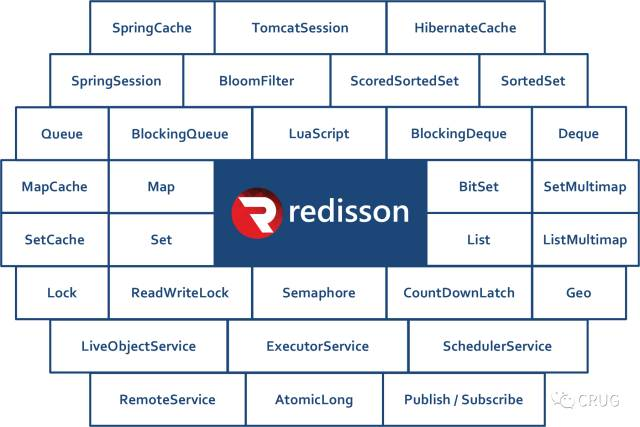

## Redisson架构
Redisson作为独立节点可以用于独立执行其他节点发布到分布式执行服务 和 分布式调度任务服务里的远程任务。架构图如下：
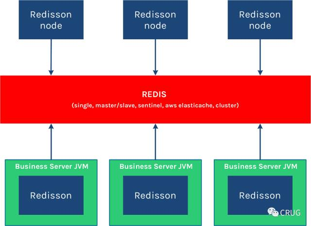

Redisson底层采用的是Netty 框架。支持Redis 2.8以上版本，支持Java1.6+以上版本。如果你现在正在使用其他的Redis的Java客户端，那么Redis命令和Redisson对象匹配列表 能够帮助你轻松的将现有代码迁徙到Redisson框架里来。

## 性能

我们很多人都或多或少使用过Redis或了解过Redis，我们之所以选择使用Redis，主要是基于Redis的高性能，对一般人的知识认知，Redis的性能大约在55000 ~ 75000 QPS。然而对于Redisson Pro又将会带给我们怎样的惊喜呢？

为了比较，我们选择非常流行的Redis Java 客户端 Jedis 和 Redisson Pro进行对比。对比过程中主要选择了非常通用的命令进行压测：HSET，RPUSH、SADD、SET 和 INCR。

**环境说明：**

1. 有效载荷大小为：6 bytes
2. 测试所用机型：Core i7 3612QM  16GB内存
3. Benchmark 测试都是在同一机器上进行，并且是针对单实例压测

**压测结果展示：**

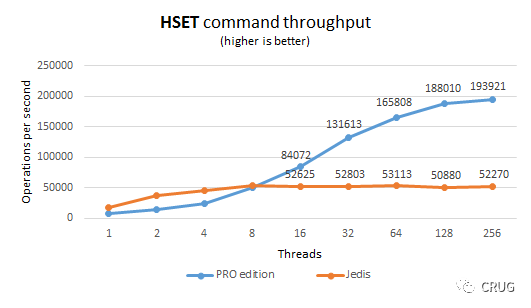
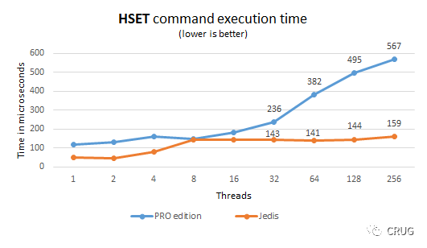
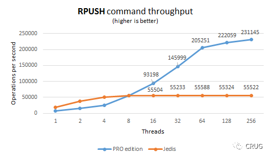
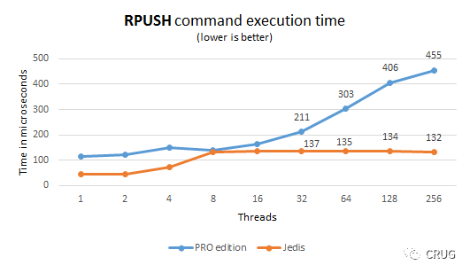
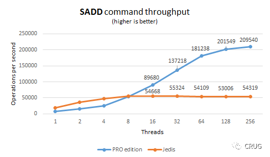
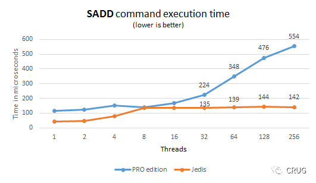
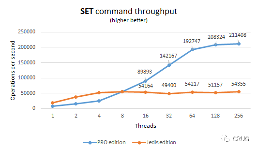
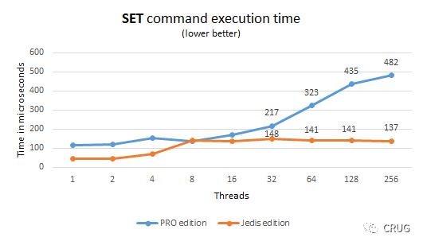
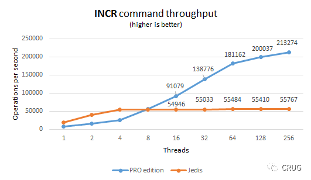
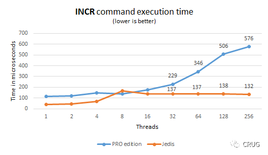

**总结**

从上述提供的基准压测结果已经非常清楚地表明Redisson Pro对于那些吞吐量和延迟敏感的系统是非常明智的选择，Redisson Pro 要比Jedis 更能有效的充分利用现有的系统资源，从而提供高性能的服务，从经验中来看，Redisson Pro能够提供高达 10w ~ 21.3w QPS，这也是官网极力推荐的原因（redis官网推荐https://redis.io/clients）。

到这里，或许你已经非常充满兴趣了，但是仍然不解你的好奇心，那么就让我来告诉你Redisson Pro 较开源版（Open source）的区别吧 ：）

## Redisson PRO的主要优点

* Redis集群管理API，可以通过程序化的方式操作所有redis-trib.rb里的功能
* Redis部署API，可以通过程序化的方式远程登录一台主机并部署、运行Redis服务
* 针对大容量的Map和Set实现自动分片的功能，把一个大集合分割成几个小的集合，然后将他们分布在Redis集群里。好处在于整个操作对用户透明，同时增加该集合的吞吐量
* 高速引擎，在高并发的情况下，专业版较开源版性能提升8倍，其中4倍吞吐量和两倍的响应速度
* 提供Dropwizard的统计功能，可以用来实现使用情况的可视化
* 更多介绍请参考：https://redisson.pro/

介绍到这里，不知道对大家有没有一点点作用，如果能帮到你，此次整理总结就很欣慰了！对Redis中国用户组（CRUG）有了解的同学，很可能已经知道了，CRUG是Redisson Pro中国区唯一授权代理经销商，为了给国内的企业谋福利，通过CRUG购买Pro版能够享受更多更大的优惠，另外为反馈社区，回报技术群，首次对外发布《Redisson白皮书》，下载地址是：链接https://pan.baidu.com/s/1hrTXTCo 密码: y34u

购买请联系：crug@redis.cn  或致电：18612720739（张）垂询

写在最后：本文翻译整理自https://github.com/redisson/redisson/wiki/1.-Overview 和 https://dzone.com/articles/redisson-pro-vs-jedis-which-is-faster，得到原作者Nikita Koksharow 允许。感谢另一位作者顾睿校审，有问题也可以通过我或直接联系原作者。感谢大家阅读~~~  么么哒😘
